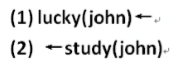
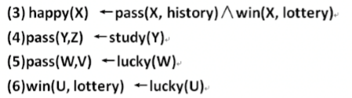

# 一个基于Horn子句的简单证明系统

## Features

+ 无需任何依赖

+ 详尽的推理过程

## Quick Start

### 示例1：快乐的John

引入本例中用到的库

```python
from lib.happy_john import HappyJohn
from entity.system import System
from entity.horn_clause import HornClause
```

用Horn子句声明证明目标

```python
# 等价于：John是快乐的
t = HornClause(None, [HappyJohn.happy.exec(["John"])])
```

建立事实集，其中的`lucky`，`study`是“谓词”对象，本例中用到的所有谓词对象和规则子句统一在 src/lib/happy_john.py 文件中声明

```python
# 事实集
facts_set = [
    # 子句"John快乐 <- None"，这里的lucky是HappyJohn库中声明的谓词对象
    HornClause(HappyJohn.lucky.exec(["John"]), []),
    # 子句"None <- John学习"
    HornClause(None, [HappyJohn.study.exec(["John"])])
]
```

上面声明的子句于下图中的符号表达等价：



用上面声明的证明目标实例化一个证明系统，并将事实集与规则集引入，本例用到的规则子句在 HappyJohn 库中统一声明，通过`get_rules_set`方法引入

```python
# 实例化一个证明系统
sys = System(target=t)

# 向系统中添加规则和事实集
sys.add_rules(rules=HappyJohn.get_rules_set())
sys.add_facts(facts=facts_set)
```

在 HappyJohn 库中声明的规则子句与下面的符号表达等价：



打印当前推理系统中所有的子句（可选，对推理过程没有影响）

```python
sys.show()
```

`show`方法的效果如下（`None`在本系统的输出中表示占位符，即该位置没有文字）：

```
# 事实
John幸运 <- None
None <- John学习

# 规则
<变量A>快乐 <- <变量A>通过历史考试, <变量A>中奖
<变量A>通过<变量B> <- <变量A>学习
<变量A>通过<变量B> <- <变量A>幸运
<变量A>中奖 <- <变量A>幸运

# 目标
None <- John快乐
```

开始推理，`debug`参数指定是否将推理过程输出到控制台

```python
sys.run(debug=True)
```


### 推理过程（控制台输出）

+ **输出信息释义**
  每个输出的信息块都具有如下所示的结构

  ```
  In "_run_rec", current clause: "None <- John快乐"
  Available clause(s) of current node:
  0: <变量A>快乐 <- <变量A>通过历史考试, <变量A>中奖
  Each of them generates a branch.
  Sub_node 0: new clause "None <- John通过历史考试, John中奖",
  	from unity of "None <- John快乐" and "<变量A>快乐 <- <变量A>通过历史考试, <变量A>中奖".
  ```

  + 首部：指出当前节点的Horn子句

    ```
    In "_run_rec", current clause: "None <- John快乐"
    ```

  + 中部：列出当前子句库中所有可与当前节点子句发生消解的子句，子句前会带上序号

    ```
    Available clause(s) of current node:
    0: <变量A>快乐 <- <变量A>通过历史考试, <变量A>中奖
    Each of them generates a branch.
    ```

    **特殊情况1**：库中没有可以与当前子句消解的子句，节点回溯，此时信息块没有尾部

    ```
    There is not any available clause, fail and return.
    Branch fail and rollback.
    ```

    如果树的所有分支都出现`fail`，则证明失败，程序退出（在本例中不会出现）

    ```
    There is not any available clause, fail and return.
    Branch fail and rollback.
    Branch fail and rollback.
    Branch fail and rollback.
    证明失败
    ```

    **特殊情况2**：当前子句是空子句，说明证明成功，程序会回溯根节点的路径并结束

    ```
    Current clause is an empty clause.
    ```

  + 尾部：计算当前子句与所有可消解子句的消解结果，并逐一列出；正常情况下，下一个节点（信息块）将从本节点尾部的 0 号子节点开始

    ```
    Sub_node 0: new clause "None <- John通过历史考试, John中奖",
    	from unity of "None <- John快乐" and "<变量A>快乐 <- <变量A>通过历史考试, <变量A>中奖".
    ```

本例 HappyJohn 的完整输出信息如下：

```
In "_run_rec", current clause: "None <- John快乐"
Available clause(s) of current node:
0: <变量A>快乐 <- <变量A>通过历史考试, <变量A>中奖
Each of them generates a branch.
Sub_node 0: new clause "None <- John通过历史考试, John中奖",
	from unity of "None <- John快乐" and "<变量A>快乐 <- <变量A>通过历史考试, <变量A>中奖".

In "_run_rec", current clause: "None <- John通过历史考试, John中奖"
Available clause(s) of current node:
0: <变量A>通过<变量B> <- <变量A>学习
1: <变量A>通过<变量B> <- <变量A>幸运
Each of them generates a branch.
Sub_node 0: new clause "None <- John中奖, John学习",
	from unity of "None <- John通过历史考试, John中奖" and "<变量A>通过<变量B> <- <变量A>学习".
Sub_node 1: new clause "None <- John中奖, John幸运",
	from unity of "None <- John通过历史考试, John中奖" and "<变量A>通过<变量B> <- <变量A>幸运".

In "_run_rec", current clause: "None <- John中奖, John学习"
Available clause(s) of current node:
0: <变量A>中奖 <- <变量A>幸运
Each of them generates a branch.
Sub_node 0: new clause "None <- John学习, John幸运",
	from unity of "None <- John中奖, John学习" and "<变量A>中奖 <- <变量A>幸运".

In "_run_rec", current clause: "None <- John学习, John幸运"
There is not any available clause, fail and return.
Branch fail and rollback.

In "_run_rec", current clause: "None <- John中奖, John幸运"
Available clause(s) of current node:
0: <变量A>中奖 <- <变量A>幸运
Each of them generates a branch.
Sub_node 0: new clause "None <- John幸运",
	from unity of "None <- John中奖, John幸运" and "<变量A>中奖 <- <变量A>幸运".

In "_run_rec", current clause: "None <- John幸运"
Available clause(s) of current node:
0: John幸运 <- None
Each of them generates a branch.
Sub_node 0: new clause "None <- None",
	from unity of "None <- John幸运" and "John幸运 <- None".

In "_run_rec", current clause: "None <- None"
Current clause is an empty clause.
Succeed and return "None <- None"
Succeed and return "None <- John幸运"
Succeed and return "None <- John中奖, John幸运"
Succeed and return "None <- John通过历史考试, John中奖"
```


### 示例2：亲属关系推理

见代码仓库中的 src/example_of_ralatices.py 文件，结构与示例1相似，这里不再重复演示

## 新建一个推理？

1. 调用`Predicate`类的构造方法或批量声明方法声明自定义的谓词
2. 调用谓词对象的`exec`方法生成文字对象
3. 调用`HornClause`类的构造方法，从文字对象创建Horn子句
4. 建立事实库和规则库（Horn子句组成的序列）
5. 声明一个Horn子句作为证明目标，使用它构造一个证明系统
6. 向证明系统中引入事实库和规则库
7. 调用证明系统的`run`方法开始推理，该方法返回一个布尔值，表示成功与否

